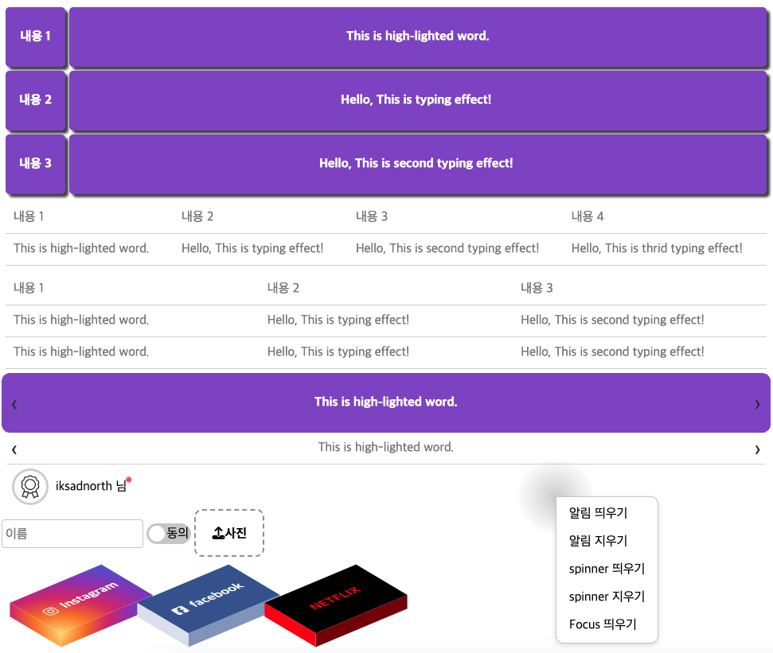

# CSS Sandbox

CSS 운용 능력을 증명하기 위한 프로젝트입니다.

웹 제품 개발에서 화면 표현 능력은 CSS 활용 능력에 비례한다고 생각합니다. CSS 라이브러리에 의존하지 않고도 다양한 UI 컴포넌트를 구현할 수 있는 역량을 갖추기 위해 진행한 토이 프로젝트입니다.

## 🎯 프로젝트 목적

- CSS 라이브러리 없이 순수 CSS로 다양한 UI 컴포넌트 구현
- CSS 변수와 calc() 함수를 활용한 유연한 스타일링
- 재사용 가능하고 커스터마이징이 용이한 컴포넌트 설계

## 🚀 구현 결과물

**데모 사이트**: https://iksadnorth.github.io/sandbox/



## 📦 구현된 컴포넌트

- **3D Box**: 3D 변환을 활용한 입체 박스
- **Carousel**: 슬라이드 캐러셀
- **Context Menu**: 우클릭 컨텍스트 메뉴
- **Custom Cursor**: 관성 효과가 있는 커스텀 커서
- **File Box**: 파일 업로드 입력 필드
- **Highlight**: 텍스트 하이라이트 효과
- **Overlay**: 포커스 오버레이
- **Spinner**: 로딩 스피너
- **Switch**: 토글 스위치
- **Text Input**: 플로팅 레이블 입력 필드
- **Toast**: 알림 토스트 메시지
- **Typing Effect**: 타이핑 애니메이션 효과

## 💡 주요 특징

### 1. 외부 라이브러리 최소화

FontAwesome 아이콘 라이브러리를 제외한 모든 외부 CSS 라이브러리를 사용하지 않았습니다.

### 2. CSS 변수를 활용한 커스터마이징

CSS 변수(Custom Properties)를 활용하여 각 컴포넌트의 속성을 쉽게 조정할 수 있도록 설계했습니다.

```css
/* 3d-box.css */
:root {
    --box-x: 200px;
    --box-y: 100px;
    --box-z: 20px;
}

/* 3D 속성 설정 */
.box {
    display: inline-block;
    width: var(--box-x); 
    height: var(--box-y); 

    position: relative;
    top: calc(-0.25 * var(--box-y)); 
    left: var(--box-y);

    transform-style: preserve-3d;
    transform: translate(-50%, -50%) 
               rotateX(60deg) 
               rotateY(0deg) 
               rotateZ(-40deg)
               translateZ(calc(-1 * var(--box-y)))
               translateZ(0px);
}
```

### 3. 모듈화된 코드 구조

각 컴포넌트는 독립적인 CSS와 JavaScript 파일로 구성되어 있으며, 함수 스코프를 고려한 코드 작성으로 전역 스코프 오염을 방지했습니다.

```javascript
(function() {
    const containers = document.querySelectorAll('.box');
    containers.forEach(wrappWithDiv);
})();
```
